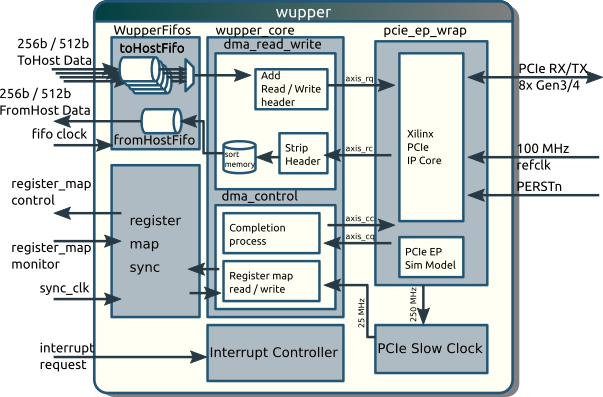

## Block Diagram

## Description

Wupper is designed by [Nikhef](http://www.nikhef.nl) (Amsterdam, The Netherlands) for the CERN [ATLAS](http://atlas.cern) / [FELIX](https://atlas-project-felix.web.cern.ch/atlas-project-felix) project.
Its main purpose is to provide a simple Direct Memory Access (DMA) interface to the Xilinx Virtex-7 PCIe Gen3 hard block.
Wupper is specifically designed for the 256 bit wide AXI4-Stream interface of the [Xilinx Virtex-7 FPGA Gen3 Integrated Block for PCI Express (PCIe)](https://www.xilinx.com/products/intellectual-property/7_series_gen_3_pci_express.html).
Wupper has been also successfully ported to Xilinx Kintex UltraScale FPGAs.

#### DMA read and write

The main purpose of Wupper is therefore to provide an interface to standard FIFOs.
This is the done by the _DMA\_read\_write_ block in the diagram above.
The read/write FIFOs have the same width as the Xilinx AXI4-Stream interface (256 bits for PCIe Gen3 and 512 bits for PCIe Gen4 inter) and run at 250 MHz.
The application side of the FPGA design can simply read or write the FIFOs.
Wupper will handle the transfer to Host PC memory, according to the addresses specified in the _DMA descriptors_.

#### DMA control

Another functionality of Wupper is thus to manage a set of DMA descriptors.
Descriptors consist of an address, a read/write flag, the transfer size (number of 32 bit words) and an enable line.
Descriptors are handled by the _DMA\_control_ block.
These descriptors are mapped as normal PCIe memory or IO registers.
Besides the descriptors and the enable line (one per descriptor), a status register for every descriptor is provided in the register map.

#### Generic register map

Besides DMA specific functions, the DMA control block can also handle generic _control_ and _monitor_ registers for user application.

#### Interrupt handler

Wupper is provided with a generic MSI-X compatible interrupt controller.

#### Implementation info

* For synthesis and implementation of the cores, it is recommend to use Xilinx Vivado 2020.1.
* Other IP cores (clock wizard and PCIe) are provided in the Xilinx .xci format, as well as the constraints file (.xdc) is in the Vivado 2020.1 Format, FIFO cores are using XPM macros.
* For Versal devices, Vivado 2020.1 is used as well, but there may be better support in later Vivado editions. We will upgrade later.
* The Virtex Ultrascale+ VU9P works with PCIe Gen4 however this was officially dropped by Xilinx. To use these devices with Gen4, Vivado 2018.1 has to be used.

For portability reasons, no Xilinx project files will be supplied with Wupper.
Instead, a bundle of _TCL scripts_ has been supplied to create a project and import all necessary files, as well as to do the synthesis and implementation.
These scripts are be described in details in the [/documentation/wupper.pdf](documentation/wupper.pdf) distributed with Wupper.

## Feedback

\>> Give comments and feedback using the official core thread on the OpenCores forum:
[forum\_thread](http://opencores.org/forum,Cores,0,5580)
